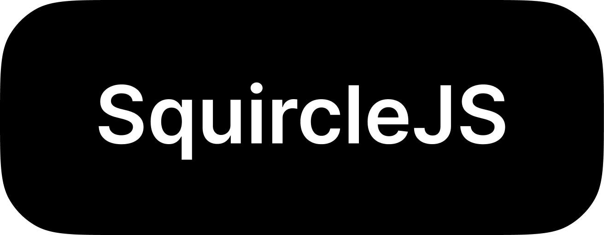

<p align="center">
  
</p>

<!-- <h1 align="center">SquircleJS</h1> -->
<p align="center">
  This project aims to bring the iOS-style squircle to your front-end projects.
</p>
<p align="center">
  <a href="https://squircle.js.org/">📕 Documentation</a>
</p>

## Features

- 💃 Responsive squircle element that can be used any an intrinsic component.
- 🙏 Fallback solution for No-JavaScript.
- 👌 CommonJS and ES6 (tree-shakeable).
- 🚀 Available for React (with `react@18` support), with other frameworks coming later.
- 🐁 Just `2.1kB` gzipped.
- 🧨 Documented usage examples.

### Drawbacks

- Uses JavaScript to apply corner smoothing (no way to do it with CSS only for now).
- Does not currently support `border-width`. Works great with just background color.

## What the 🤡 is a Squircle???

This is a valid question and not everyone is aware of what a Squircle is.
<q>A squircle is an intermediate shape between a square and a circle</q> - [Webflow Blog](https://webflow.com/blog/squircle-vs-rounded-squares).
If you've ever seen an iPhone home screen, you've seen a squircle.
When you add additional corner smoothing to a regular rectangle with rounded corners, you get a squircle.
It's a [long story](https://www.figma.com/blog/desperately-seeking-squircles/), but in short - you can't achieve Squircles in plain CSS, we have to do extra calculations for that, which is where the [figma-squircle](https://github.com/phamfoo/figma-squircle) package comes in. Building on top of that package, this project adds bindings for UI libraries that make it possible to use it just like a regular html component, without worrying about layout-specific things.

Visually, [this post from Figma Blog](https://www.figma.com/blog/desperately-seeking-squircles/) shows the difference really well:


## Usage

### With React

#### Step 1

Star this repo ❤️

#### Step 2

Install the package

```bash
pnpm add @squircle-js/react
```

#### Step 3

Add to your project

```tsx
import { Squircle } from "@squircle-js/react";

const YourComponent = () => {
  return (
    <Squircle
      cornerRadius={10}
      cornerSmoothing={1}
      className="p-4 bg-black text-white"
    >
      Squircle!
    </Squircle>
  );
};
```

Also, add a global component to ensure it still works when JavaScript is disabled.

```tsx
// _app.tsx, or root-level layout.tsx
import { SquircleNoScript } from "@squircle-js/react";

...
<SquircleNoScript />
...
```

## Websites using it

- [quassum.com](https://quassum.com/?utm_source=squircle-js)

## License

This project is licensed under [MIT License](./LICENSE)
